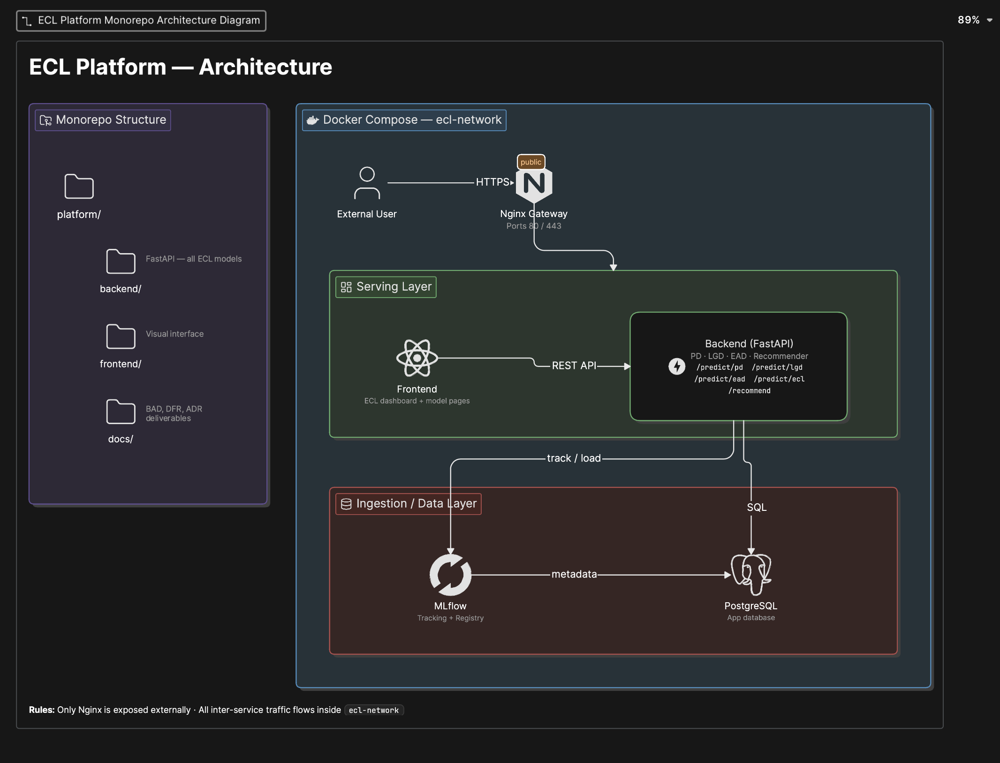

# Architecture Decision Record (ADR)
**Projet** : Outil de Recommandation de Crédit — Gamme ECL (PD / LGD / EAD)
**Client** : Fintech — Transfert de Fonds International
**Rédacteur** : Équipe Consulting
**Version** : 1.0
**Statut** : Validé client — Prêt pour phase Projet
**Date** : Juin 2025

---

## Résumé Exécutif

Ce document formalise les décisions techniques structurantes prises lors de l'Epic 0.3. Il couvre la stack technique, l'organisation du code, le découpage des composants, les contrats d'interface, la stratégie de conteneurisation et la vision d'évolution vers la Phase 2. Il constitue le référentiel technique officiel du projet et le déclencheur de la phase Projet.

---

## 1. Stack Technique

### 1.1 Décisions validées

| Couche | Outil | Justification |
|---|---|---|
| Langage | Python | Standard industrie ML/Data |
| Serving API | FastAPI | Performant, typage fort, faible latence, documentation automatique |
| Conteneurisation | Docker + Docker Compose | Cohérent BAD Phase 1, portable, cloud-ready |
| Tracking & Artefacts | MLflow | Gestion des runs, versioning des modèles, registry intégré |
| Base de données | PostgreSQL | Robuste, open source, compatible évolution Phase 2 |
| Gateway | Nginx | Point d'entrée unique, simple, suffisant pour MVP |

### 1.2 Stack ML

| Usage | Librairie | Justification |
|---|---|---|
| Modélisation tabulaire | scikit-learn, XGBoost, LightGBM | Standard industrie crédit, performant sur données tabulaires |
| Baseline PD | Régression logistique (scikit-learn) | Interprétable, auditable IFRS 9 / Bâle III |
| Interprétabilité | SHAP | Obligatoire pour expliquer les décisions aux régulateurs |
| Phase 2 (si séquentiel) | PyTorch | Données comportementales séquentielles uniquement |

> **Note** : PyTorch n'est pas retenu pour la Phase 1. Les modèles tabulaires (XGBoost / LightGBM) sont prioritaires pour leur performance, leur interprétabilité et leur conformité réglementaire. PyTorch sera reconsidéré en Phase 2 si des données séquentielles sont intégrées.

---

## 2. Organisation du Code — Monorepo

### 2.1 Décision

Architecture monorepo — un seul projet, répertoires dédiés par composante. Les logiques transversales sont partagées via un module `shared/`.

### 2.2 Structure du projet

```
platform/
├── backend/
│   ├── models/
│   │   ├── pd/           # Modèle Probabilité de Défaut
│   │   ├── lgd/          # Modèle Loss Given Default
│   │   └── ead/          # Modèle Exposure at Default
│   ├── shared/           # Logiques transversales
│   │   ├── preprocessing/
│   │   ├── evaluation/
│   │   └── utils/
│   ├── api/              # FastAPI — endpoints serving
│   └── recommendation/   # Composant de recommandation
├── frontend/             # Interface visuelle
└── docs/                 # Livrables pré-projet
    ├── BAD_v1.1.md
    ├── DFR_v1.0.md
    └── ADR_v1.0.md       # Ce document
```

### 2.3 Justification

- Les trois modèles partagent les mêmes logiques de preprocessing et d'évaluation
- Les runs MLflow sont mutualisés — seuls les hyperparamètres et modes d'évaluation diffèrent
- La structure est scalable vers des microservices en Phase 2 sans refonte du code

---

## 3. Découpage des Composants & Contrats d'Interface

### 3.1 Endpoints FastAPI

| Endpoint | Input | Output |
|---|---|---|
| `POST /predict/pd` | features client | `{ pd, label, threshold }` |
| `POST /predict/lgd` | features contrat | `{ lgd }` |
| `POST /predict/ead` | features exposition | `{ ead }` |
| `POST /predict/ecl` | features combinées | `{ pd, lgd, ead, ecl }` |
| `POST /recommend` | client_id + mode | `{ products, ecl_summary }` |

> **Formule ECL** : ECL = PD × LGD × EAD

### 3.2 Règle de consommation

Le composant de recommandation consomme les sorties des trois modèles via l'endpoint `/predict/ecl` et applique les règles métier pour produire une recommandation produit. La consommation est exclusivement API — aucun accès direct aux modèles.

---

## 4. Architecture de Conteneurisation

### 4.1 Services Docker Compose

| Service | Exposition | Accès autorisé |
|---|---|---|
| Nginx | Port 80/443 — public | Point d'entrée unique |
| Backend (FastAPI) | Interne uniquement | Via Nginx |
| Frontend | Interne uniquement | Via Nginx |
| MLflow | Interne uniquement | Backend uniquement |
| PostgreSQL | Interne uniquement | Backend + MLflow |

### 4.2 Principe de sécurité réseau

Seul Nginx est exposé à l'extérieur. Tous les services communiquent exclusivement à l'intérieur du réseau Docker `ecl-network`. Aucun port interne n'est accessible directement depuis l'extérieur.

### 4.3 Schéma d'architecture

*(Voir diagramme joint — architecture_ecl_platform.png)*


---

## 5. Mode d'Ingestion & Serving

| Couche | Mode | Décision |
|---|---|---|
| Ingestion des données | Hybride | Pipeline batch ET stream — coexistants dès le MVP |
| Serving des recommandations | Hybride | Batch au login + temps réel selon navigation |
| Latence | Contrainte de conception | Optimisée dès le MVP, pas une optimisation future |

> **Principe** : ingestion et serving sont deux couches distinctes. L'architecture hybride est une contrainte de conception, pas une évolution future.

---

## 6. Stratégie d'Évolution — Phase 2

| Élément | Phase 1 (MVP) | Phase 2 (Web App) |
|---|---|---|
| Infra | Docker Compose local | Docker Compose cloud (AWS / GCP / Azure) |
| Gateway | Nginx interne | Load balancer cloud + domaine public + SSL |
| Base de données | PostgreSQL local | Base managée (RDS, Cloud SQL) |
| MLflow | Local | Instance cloud ou Databricks |
| Accès | Réseau privé | HTTPS public + authentification |
| Architecture code | Monorepo | Migration microservices si volume justifie |

> **Principe cloud-ready** : l'architecture Phase 1 est conçue pour un lift-and-shift vers le cloud sans refonte du code applicatif.

---

## 7. Alternatives Considérées

| Décision | Alternative écartée | Raison |
|---|---|---|
| FastAPI | Flask | FastAPI plus performant, typage natif, async |
| Monorepo | Microservices dès Phase 1 | Complexité injustifiée pour phase de recherche |
| XGBoost/LightGBM | PyTorch Phase 1 | Données tabulaires — modèles classiques supérieurs |
| Nginx | Kong, Traefik | Nginx suffisant pour MVP, moins de complexité |
| Docker Compose | Kubernetes | Over-engineering pour Phase 1 |

---


## 8. Feu Vert pour la Phase Projet

| Condition | Statut |
|---|---|
| Stack technique validée | ✅ |
| Découpage des composants arrêté | ✅ |
| Contrats d'interface définis | ✅ |
| Stratégie de conteneurisation validée | ✅ |
| ADR rédigé et validé | ✅ |

**La phase Projet est débloquée.**

---

### ADR-XX — Ordre des opérations de préparation des données

**Contexte**
Le dataset Freddie Mac présente un déséquilibre de classes marqué —
les défauts représentent une minorité des observations.
La question de l'ordre des opérations de rééquilibrage a été tranchée
en session client Juin 2026.

**Décision**

| Étape | Opération                              | Table concernée         |
|-------|----------------------------------------|-------------------------|
| 1     | Cleaning                               | Historique brut         |
| 2     | Construction des agrégats / features   | Historique brut         |
| 3     | Jointure avec table origination        | Table jointe            |
| 4     | Oversampling / rééquilibrage           | Table jointe agrégée    |

**Justification**
Le rééquilibrage appliqué avant la jointure rompt l'intégrité
référentielle — les LOAN_SEQUENCE_NUMBER dupliqués par oversampling
n'ont pas de correspondance dans la table origination.
Le rééquilibrage doit donc intervenir uniquement sur la table finale,
après que chaque prêt est représenté par une seule ligne agrégée.

**Fenêtre d'observation retenue**

| Paramètre             | Valeur   |
|-----------------------|----------|
| Fenêtre d'observation | 12 mois  |
| Outcome window        | 12 mois  |
| Seuil de défaut       | 90 DPD   |

**Statut** : Décision actée — applicable dès Epic 0.2


*Document versé dans le repo projet — platform/docs/ADR_v1.0.md*
*Constitue le référentiel technique officiel pour toute la phase Projet*
